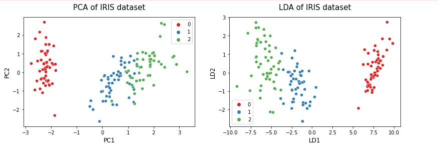

## **Demonstration of various dimensionality reduction techniques**

### Steps Performed:
1. PCA
2. SVD
3. LLE
4. t-SNE
5. ISOMAP
6. UMAP

* PCA vs LDA LDA is typically used for multi-class classification. It can also be used as a dimensionality reduction technique. LDA best separates or discriminates (hence the name LDA) training instances by their classes. The major difference between LDA and PCA is that LDA finds a linear combination of input features that optimizes class separability while PCA attempts to find a set of uncorrelated components of maximum variance in a dataset. Another key difference between the two is that PCA is an unsupervised algorithm whereas LDA is a supervised algorithm where it takes class labels into account. There are some limitations of LDA. To apply LDA, the data should be normally distributed. The dataset should also contain known class labels. The maximum number of components that LDA can find is the number of classes minus 1. If there are only 3 class labels in your dataset, LDA can find only 2 (3–1) components in dimensionality reduction. It is not needed to perform feature scaling to apply LDA. On the other hand, PCA needs scaled data. However, class labels are not needed for PCA. The maximum number of components that PCA can find is the number of input features in the original dataset.

### PCA vs LDA

* Truncated Singular Value Decomposition (SVD) This method performs linear dimensionality reduction by means of truncated singular value decomposition (SVD). It works well with sparse data in which many of the row values are zero.

### Turncated SVD of IRIS dataset

* t-distributed Stochastic Neighbor Embedding (t-SNE) This is also a non-linear dimensionality reduction method mostly used for data visualization. In addition to that, it is widely used in image processing and NLP. The Scikit-learn documentation recommends you to use PCA or Truncated SVD before t-SNE if the number of features in the dataset is more than 50.

### t-SNE of IRIS dataset

* Isometric mapping (Isomap) This method performs non-linear dimensionality reduction through Isometric mapping. It is an extension of MDS or Kernel PCA. It connects each instance by calculating the curved or geodesic distance to its nearest neighbors and reduces dimensionality. The number of neighbors to consider for each point can be specified through the n_neighbors hyperparameter of the Isomap() class which implements the Isomap algorithm in the Scikit-learn.

### ISOMAP of IRIS dataset

### Regular Swiss Roll ISOMAP

* LLE
Locally Linear Embedding (LLE) is a Manifold Learning technique that is used for non-linear dimensionality reduction. It is an unsupervised learning algorithm that produces low-dimensional embeddings of high-dimensional inputs, relating each training instance to its closest neighbor.

### Regular Swiss ROll

### Modified Swiss ROll

### Standard LLE on a regular Swiss ROll

### Modified LLE on a regular Swiss ROll

* UMAP
UMAP (Uniform Manifold Approximation and Projection) is a novel manifold learning technique for dimension reduction. UMAP is constructed from a theoretical framework based in Riemannian geometry and algebraic topology. The result is a practical scalable algorithm that applies to real world data. The UMAP algorithm is competitive with t-SNE for visualization quality, and arguably preserves more of the global structure with superior run time performance. Furthermore, UMAP has no computational restrictions on embedding dimension, making it viable as a general purpose dimension reduction technique for machine learning.
